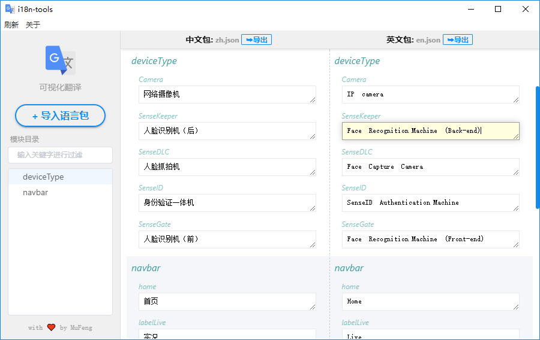

# i18n-tools

> An electron project

#### Build Setup

``` bash
# install dependencies
yarn

# serve with hot reload at localhost:9060
yarn dev

# build electron application for production
yarn build
```

### demo
 

---

This project was generated with [electron-vue](https://github.com/SimulatedGREG/electron-vue) using [vue-cli](https://github.com/vuejs/vue-cli). 

Documentation about the original structure can be found [here](https://simulatedgreg.gitbooks.io/electron-vue/content/index.html).

https://www.codeandweb.com/babeledit